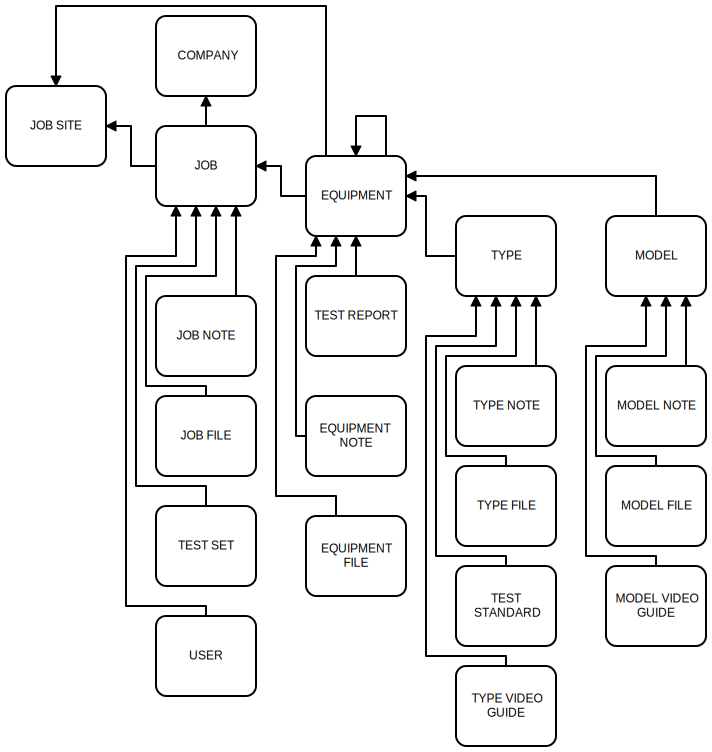

## Paragon Project Tracking 
###### Date of Readme: Dec 1, 2021

###### A platform for providing the data, resources, and information field users need.

- Developed by Blue Sky Software LC
- blueskysw.com
- Albert Withers 210-303-0471

##### 1. Description of Function

This software was created for the power distribution industry to optomize resource and information management. It allows companies to manage the information from all portions of the job in a central, accessible location. Users can define define a job by filling out information such as scope, preparation, job site access, important personnel, eeand safety requirements. Users can track job progress and issues as the job goes on. User's will add the equipment that will be worked on; within each of those equipment, they can keep track of issues with notes, files, and photos. They can also access a wealth of data related to that type and model of equipment. Data like user manuals, test standards, trip curves, drawings, required test sets, wiring diagrams, repair tuturials, test guids, part catalogs, product support, and much more. If a user does not find the data for that particular type or model, they can add it themselves and make it available for future users. All field users, managers, salespersons, and coordinators can keep track of progress and issues by simply logging in. We are also working to add test reports to the equipment, allowing user's to track their test data and instantly sync it to the program

##### 2. Code Structure

This is a web application designed for browser use. The backend is in Python with the Django framework. The front end is basic html/javascript and makes use of the Materialize framework. It makes extensive use of Django Models to map data to a SQLite database. Relations between different classes of objects provide much of the software value, consolidating data to minimize user confusion and repetitive actions. Below is a graphical diagram showing the relationships between classes of objects; this is not a perfect representation and there are instances of self-reference in some classes. Review the `models.py` file for more details.

It uses a standard Django folder structure with a Project folder that holds the Project files and subfolders and the Application folder(s). As of December 1 2021, my Project folder is named `Paragon2-main`. You will need your directory to be pointing to that folder when you run the program or migrate the database changes. The settings.py file (project settings) is in the subfolder `tracker-django`. The application folder is named `tracker`.

Within that `tracker` folder, the `urls.py` maps all the urls. The `views.py` file is used primarily to generate a page. The `constructors.py` file is very similar but it contains all the actions that make changes to the database and then reverses to some url back in `views.py`. The ``models.py` file has the model classes. The `static` subfolder has the stylesheet from materialize. The `templates/jobs` subfolder contains all the html templates. Note that the `base.html` template is extended from in every file. In a few instances, files are used recursivily with the Django Templates block/extends features. Most of the file names are pretty self explanatory. 

For user file storage, the project uses AWS's S3 Service. This means the MEDIA_ROOT does not point to the local filesystem.

Notes are used in many areas of project and they use recursion to allow users to reply to notes in a nested structure (functionality is similar to Reddit comments)

##### 3. Local Deployment

I'm using Python version 3.7.6 and have pip installed, I'm not sure what the compatibility is with other versions.

1. Download the folder and navigated your terminal to the `Paragon2-main` folder
2. The `requirements.txt` file should have all the packeges in it so you can just run `pip install -r requirements.txt` in your console. 
3. Once all packages are installed, you can run `python manage.py runserver` to start the server. 
4. Then you can open a browser page and enter `http://127.0.0.1:8000/` in the url and you should be in. 
5. For log in, use the username `greattech44` with pw `Sublette#83`. If you like, you can create your own account and go into the admin-->users and change permissions to 'superuser status' on your new account. 
6. The Django Admin site can be reached by adding `/admin` to the end of the url or clicking admin at the bottom of the page. 
7. Any time a class in `Models.py` is changed, you will have to quit the server (ctrl+C) and run `python manage.py makemigrations`, followed by `python manage.py migrate`, then restart the server. 
"# Paragon-Mobile" 
"# Paragon-Mobile" 
